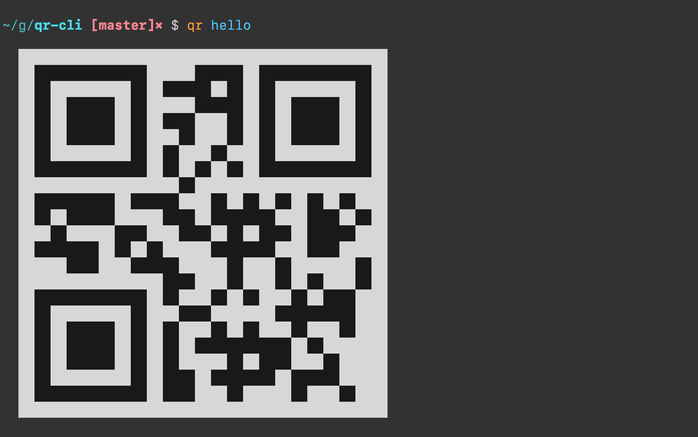

# qr-cli [![npm-version][npm-badge]][npm-link] [![install size][pp-badge]][pp-link]

Minimal viable qr code generator in terminal.

## Usage

```bash
npm i -g qr-cli
```



[npm-badge]: https://img.shields.io/npm/v/qr-cli.svg?style=flat-square
[npm-link]: https://www.npmjs.com/package/qr-cli

[pp-badge]: https://packagephobia.now.sh/badge?p=qr-cli
[pp-link]: https://packagephobia.now.sh/result?p=qr-cli
